# Prompt 指北

图片生成最近一年来，技术上的革新带来了效果上的惊人进展。
从历史的角度来看，这似乎就是一波新的艺术浪潮即将来临的前奏，就像是右图中呈现的一样，历史上的艺术成果，即将以和 AI 结合的新面目，焕发更大的活力

为了让大家更加直观的感受技术水平，可以新给大家看一下，当前通过技术手段，AI 能够取得的水平。

|  |
| :----------------------------------------------------------: |
|        蒙娜丽莎，赛博朋克，宝丽来，33毫米,蒸汽波艺术         |

## 目录
[TOC]

## 前言

Prompt 非常的重要

|  |  |  |  |
| :----------------------------------------------------------: | :----------------------------------------------------------: | ------------------------------------------------------------ | ------------------------------------------------------------ |
|                         “橘猫”(卡通)                         |              “极乐迪斯科里的猫, 故障艺术”(卡通)              | “极乐迪斯科里的猫, 故障艺术”(探索无限)                       | “极乐迪斯科里的猫, 故障艺术”(HD, Coming Soon)                |

|  |
| :----------------------------: |
|   极乐迪斯科里的猫,故障艺术    |

## 呼吁与准则

机器生成图片的最终目的还是便捷地为人类创造美的作品。而技术不是十全十美的，不能保证每次生成的图像都能够尽善尽美。因此呼吁所有相关玩家，如果想分享作品，那就分享那些美感爆棚的作品！

算法生成的图片难免会受到数据的影响，从而导致生成的图片是有数据偏见的。因此在分享机器生成图片到社交媒体之前，请三思当前的图片是不是含有：令人不适的、暴力的、色情的内容。如果有以上的内容请自行承担法律后果。

## Prompt 的设计

## Prompt 公式

Prompt = [形容词] [主语] ，[细节设定]， [修饰语或者艺术家]

按照这个公式，我们首先构造一个形容词加主语的案例

这里我构造的是 戴着眼镜的猫。

风格我选择的是油画风格

然后我再添加一些细节设定，

这里我给的是 漂浮在宇宙中

可以看到 ，猫猫的后面出现了很多天体

|  |  |  |
| :----------------------------------------------------------: | :----------------------------------------------------------: | :----------------------------------------------------------: |
|                     “戴着眼镜的猫”(油画)                     |              “戴着眼镜的猫，漂浮在宇宙中”(油画)              |         “戴着眼镜的猫，漂浮在宇宙中，高更风格”(油画)         |

最后我们想让我们的照片风格更加有艺术性的效果

我们选择的艺术家是高更

可以看到图像的画风有了更强的艺术风格

## Prompt 设计原则

### Prompt:简单原则:清楚地陈述

除了公式之外，也有一些简单的prompt设计原则分享给大家

这里的第一条原则是 要清楚的陈述

例如我们如果是简单的输入 风景的话，往往模型不知道我们想要的风景是什么样子的

我们要去尽量的幻想我们风景的样子，然后变成语言描述

例如我想想的是日落时，海边的风景

那我就构造了prompt

进一步的，我想风格化我的图像，所以我在结尾的部分，增加了 胶片感来让图片的色彩更加好看一些

但是云彩的细节丢失了一些

进一步的我再增加天边巨大云朵这一个细节，让我的图片朝着我想要的样子靠的更进一步

|  |                        |                                |                                |
| :------------------------: | :----------------------------------------------: | :------------------------------------------------------: | -------------------------------------------------------- |
|           “风景”           | “夕阳日落时，阳光落在云层上，海面波光粼粼，风景” | “夕阳日落时，阳光落在云层上，海面波涛汹涌，风景，胶片感” | 夕阳日落时，天边有巨大的云朵，海面波涛汹涌，风景，胶片感 |

### Prompt:简单原则:但是细节要适度

但是需要注意的是，我们在编辑 Prompt 的时候，也要注意细节量的控制

因为加入我们输入了过多的细节，模型很多的 时候就会顾此失彼，只有一部分的细节能够描绘出来

|  |                        |                                |
| :------------------------: | :----------------------------------------------: | :------------------------------------------------------: |
|           “风景”           | “夕阳日落时，阳光落在云层上，海面波光粼粼，风景” | “夕阳日落时，阳光落在云层上，海面波涛汹涌，风景，胶片感” |

## Prompt 主体的选择

首先是主体选择的部分，这里我们给出一些我们内部实验比较容易出效果的示例

|  |  |  |  |
| :----------------------------------------------------------: | :----------------------------------------------------------: | :----------------------------------------------------------: | :----------------------------------------------------------: |
|                            宇航员                            |                             孤岛                             |                           白色城堡                           |                            机器人                            |
|  |  |  |  |
|                             巫师                             |                            罗马城                            |                             海鸥                             |                             气球                             |

和主体共同出现的意向词。

|  |  |  |
| :----------------------------------------------------------: | :----------------------------------------------------------: | :----------------------------------------------------------: |
|                      …日落，霓虹灯…薄雾                      |                             …烟…                             |                    …燃烧漩涡, …烟雾和碎片                    |
|  |  |  |
|                            …废墟…                            |                            光之…                             |                           巨大的…                            |

## Prompt 修饰词与艺术家

###  抽象技术风格

|  |  |
| ------------------------------------------------------------ | ------------------------------------------------------------ |
| 00000_000_一只猫坐在椅子上，戴着一副墨镜,抽象技术风格.jpg   | 00000_001_日落时的城市天际线,抽象技术风格                   |

###  酸波风格

| 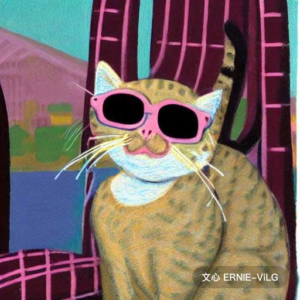 |  |
| ------------------------------------------------------------ | ------------------------------------------------------------ |
| 一只猫坐在椅子上，戴着一副墨镜,酸波风格                     | 日落时的城市天际线,酸性精灵风格                             |

###  冒险果肉风格

| 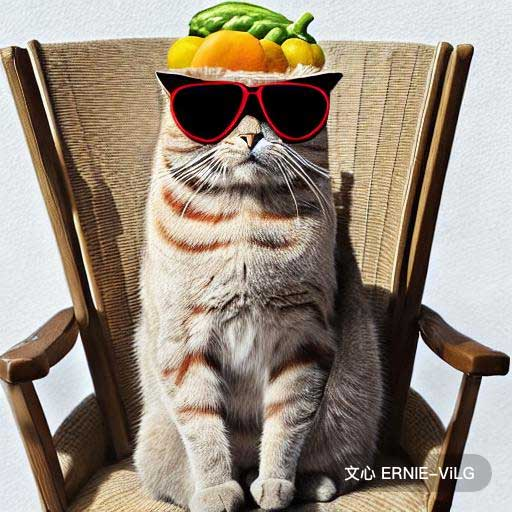 |  |
| ------------------------------------------------------------ | ------------------------------------------------------------ |
| 一只猫坐在椅子上，戴着一副墨镜,冒险果肉风格                 | 日落时的城市天际线,冒险果肉风格                             |

### 外星人风格

|  |  |
| ------------------------------------------------------------ | ------------------------------------------------------------ |
| 一只猫坐在椅子上，戴着一副墨镜,外星人风格                   | 日落时的城市天际线,外星人风格                               |

### 古埃及风格

|  |  |
| ------------------------------------------------------------ | ------------------------------------------------------------ |
| 一只猫坐在椅子上，戴着一副墨镜,古埃及风格                   | 日落时的城市天际线,古埃及风格                               |

### 风帽风格

|  |  |
| ------------------------------------------------------------ | ------------------------------------------------------------ |
| 一只猫坐在椅子上，戴着一副墨镜,风帽风格                     | 日落时的城市天际线,风帽风格                                 |

### 装饰艺术风格

|  |  |
| ------------------------------------------------------------ | ------------------------------------------------------------ |
| 一只猫坐在椅子上，戴着一副墨镜,装饰艺术风格                 | 日落时的城市天际线,装饰艺术风格                             |

### 极光风格

| 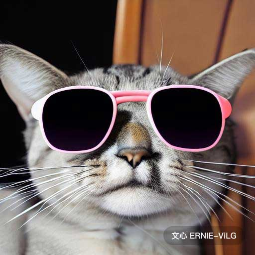 |  |
| ------------------------------------------------------------ | ------------------------------------------------------------ |
| 一只猫坐在椅子上，戴着一副墨镜,极光风格                     | 日落时的城市天际线,极光风格                                 |

###  秋天风格

|  |  |
| ------------------------------------------------------------ | ------------------------------------------------------------ |
| 日落时的城市天际线,秋天风格                                 | 一只猫坐在椅子上，戴着一副墨镜,秋天风格                     |

### 巴洛克风格

|  |  |
| ------------------------------------------------------------ | ------------------------------------------------------------ |
| 一只猫坐在椅子上，戴着一副墨镜,巴洛克风格                   | 日落时的城市天际线,巴洛克风格                               |

### 海滩兔风格

|  |  |
| ------------------------------------------------------------ | ------------------------------------------------------------ |
| 一只猫坐在椅子上，戴着一副墨镜,海滩兔风格                   | 日落时的城市天际线,海滩兔风格                               |

### 摩托车手风格

| 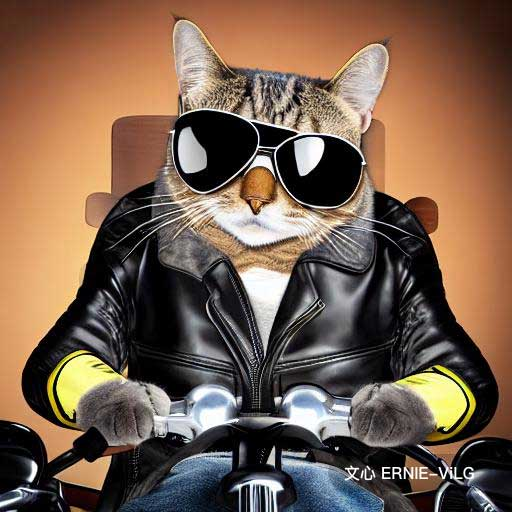 |  |
| ------------------------------------------------------------ | ------------------------------------------------------------ |
| 一只猫坐在椅子上，戴着一副墨镜,摩托车手风格                 | 日落时的城市天际线,摩托车手风格                             |

### 碎核风格

|  |  |
| ------------------------------------------------------------ | ------------------------------------------------------------ |
| 一只猫坐在椅子上，戴着一副墨镜,碎核风格                     | 日落时的城市天际线,碎核风格                                 |

### 纸箱风格

|  |  |
| ------------------------------------------------------------ | ------------------------------------------------------------ |
| 一只猫坐在椅子上，戴着一副墨镜,纸箱风格                     | 日落时的城市天际线,纸箱风格                                 |

### 未来主义风格

| 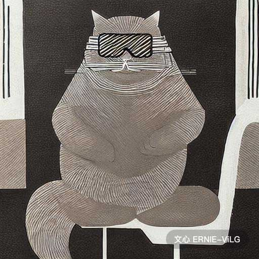 |  |
| ------------------------------------------------------------ | ------------------------------------------------------------ |
| 一只猫坐在椅子上，戴着一副墨镜,未来主义风格                 | 一只猫坐在椅子上，戴着一副墨镜,未来主义风格                 |

### 建构主义风格

|  |  |
| ------------------------------------------------------------ | ------------------------------------------------------------ |
| 一只猫坐在椅子上，戴着一副墨镜,建构主义风格                 | 日落时的城市天际线,建构主义风格                             |

### 孟菲斯公司风格

|  |  |
| ------------------------------------------------------------ | ------------------------------------------------------------ |
| 一只猫坐在椅子上，戴着一副墨镜,孟菲斯公司风格               | 日落时的城市天际线,孟菲斯公司风格                           |

### 立体主义风格

|  |  |
| ------------------------------------------------------------ | ------------------------------------------------------------ |
| 一只猫坐在椅子上，戴着一副墨镜,立体主义风格                 | 日落时的城市天际线,立体主义风格                             |

### 赛博朋克风格

|  |  |
| ------------------------------------------------------------ | ------------------------------------------------------------ |
| 一只猫坐在椅子上，戴着一副墨镜,赛博朋克风格                 | 日落时的城市天际线,赛博朋克风格                             |

### 黑暗自然主义风格

|  |  |
| ------------------------------------------------------------ | ------------------------------------------------------------ |
| 一只猫坐在椅子上，戴着一副墨镜,黑暗自然主义风格             | 日落时的城市天际线,黑暗自然主义风格                         |

### 表现主义风格

|  | 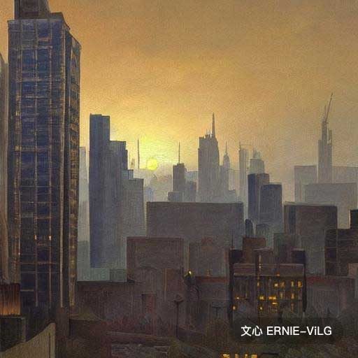 |
| ------------------------------------------------------------ | ------------------------------------------------------------ |
| 一只猫坐在椅子上，戴着一副墨镜,表现主义风格                 | 日落时的城市天际线,表现主义风格                             |

### 野兽派风格

|  |  |
| ------------------------------------------------------------ | ------------------------------------------------------------ |
| 一只猫坐在椅子上，戴着一副墨镜,野兽派风格                   | 日落时的城市天际线,野兽派风格                               |

### 鬼魂风格

|  |  |
| ------------------------------------------------------------ | ------------------------------------------------------------ |
| 一只猫坐在椅子上，戴着一副墨镜,鬼魂风格                     | 日落时的城市天际线,鬼魂风格                                 |

### 嘻哈风格

|  |  |
| ------------------------------------------------------------ | ------------------------------------------------------------ |
| 一只猫坐在椅子上，戴着一副墨镜,嘻哈风格                     | 日落时的城市天际线,嘻哈风格                                 |

### 嬉皮士风格

|  |  |
| ------------------------------------------------------------ | ------------------------------------------------------------ |
| 一只猫坐在椅子上，戴着一副墨镜,嬉皮士风格                   | 日落时的城市天际线,嬉皮士风格                               |

### 幻象之城风格

|  |  |
| ------------------------------------------------------------ | ------------------------------------------------------------ |
| 一只猫坐在椅子上，戴着一副墨镜,幻象之城风格                 | 日落时的城市天际线,幻象之城风格                             |

### 印象主义风格

|  |  |
| ------------------------------------------------------------ | ------------------------------------------------------------ |
| 一只猫坐在椅子上，戴着一副墨镜,印象主义风格                 | 日落时的城市天际线,印象主义风格                             |

### 卡瓦伊风格

|  |  |
| ------------------------------------------------------------ | ------------------------------------------------------------ |
| 一只猫坐在椅子上，戴着一副墨镜,卡瓦伊风格                   | 日落时的城市天际线,卡瓦伊风格                               |

### 美人鱼风格

|  |  |
| ------------------------------------------------------------ | ------------------------------------------------------------ |
| 一只猫坐在椅子上，戴着一副墨镜,美人鱼风格                   | 日落时的城市天际线,美人鱼风格                               |

### 极简主义风格

|  |  |
| ------------------------------------------------------------ | ------------------------------------------------------------ |
| 一只猫坐在椅子上，戴着一副墨镜,极简主义风格                 | 日落时的城市天际线,极简主义风格                             |

### 水井惠郎风格

|  |  |
| ------------------------------------------------------------ | ------------------------------------------------------------ |
| 一只猫坐在椅子上，戴着一副墨镜,水井惠郎风格                 | 日落时的城市天际线,水井惠郎风格                             |

### 苔藓风格

| 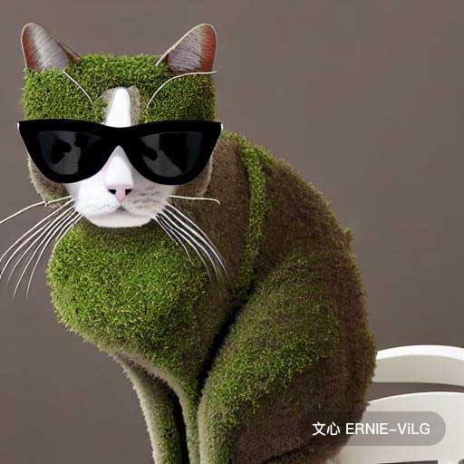 |  |
| ------------------------------------------------------------ | ------------------------------------------------------------ |
| 一只猫坐在椅子上，戴着一副墨镜,苔藓风格                     | 日落时的城市天际线,苔藓风格                                 |

### 新浪潮风格

|  |  |
| ------------------------------------------------------------ | ------------------------------------------------------------ |
| 一只猫坐在椅子上，戴着一副墨镜,新浪潮风格                   | 日落时的城市天际线,新浪潮风格                               |

### 迷宫物语风格

|  |  |
| ------------------------------------------------------------ | ------------------------------------------------------------ |
| 一只猫坐在椅子上，戴着一副墨镜,迷宫物语风格                 | 日落时的城市天际线,迷宫物语风格                             |

### 仙女风格

|  |  |
| ------------------------------------------------------------ | ------------------------------------------------------------ |
| 一只猫坐在椅子上，戴着一副墨镜,仙女风格                     | 日落时的城市天际线,仙女风格                                 |

### 粉彩朋克风格

|  |  |
| ------------------------------------------------------------ | ------------------------------------------------------------ |
| 一只猫坐在椅子上，戴着一副墨镜,粉彩朋克风格                 | 日落时的城市天际线,粉彩朋克风格                             |

###  照片写实风格

|  |  |
| ------------------------------------------------------------ | ------------------------------------------------------------ |
| 一只猫坐在椅子上，戴着一副墨镜,照片写实风格                 | 日落时的城市天际线,照片写实风格                             |

### 粉红公主风格

|  |  |
| ------------------------------------------------------------ | ------------------------------------------------------------ |
| 一只猫坐在椅子上，戴着一副墨镜,粉红公主风格                 | 日落时的城市天际线,粉红公主风格                             |

### 海盗风格

|  |  |
| ------------------------------------------------------------ | ------------------------------------------------------------ |
| 日落时的城市天际线,海盗风格                                 | 一只猫坐在椅子上，戴着一副墨镜,海盗风格                     |

### 像素可爱风格

|  | 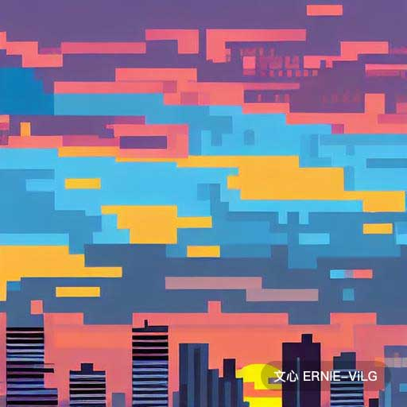 |
| ------------------------------------------------------------ | ------------------------------------------------------------ |
| 一只猫坐在椅子上，戴着一副墨镜,像素可爱风格                 | 日落时的城市天际线,像素可爱风格                             |

### 波普艺术风格

|  |  |
| ------------------------------------------------------------ | ------------------------------------------------------------ |
| 一只猫坐在椅子上，戴着一副墨镜,波普艺术风格                 | 日落时的城市天际线,后世界末日风格                           |

### 史前遗迹风格

|  |  |
| ------------------------------------------------------------ | ------------------------------------------------------------ |
| 一只猫坐在椅子上，戴着一副墨镜,史前遗迹风格                 | 日落时的城市天际线,史前遗迹风格                             |

### 迷幻风格

|  |  |
| ------------------------------------------------------------ | ------------------------------------------------------------ |
| 一只猫坐在椅子上，戴着一副墨镜,迷幻风格                     | 日落时的城市天际线,迷幻风格                                 |

### 雨天风格

|  | 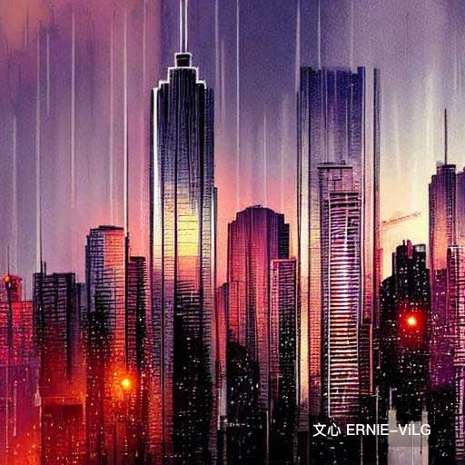 |
| ------------------------------------------------------------ | ------------------------------------------------------------ |
| 日落时的城市天际线,雨天风格                                 | 一只猫坐在椅子上，戴着一副墨镜,雨天风格                     |

### 复古未来主义风格

|  |  |
| ------------------------------------------------------------ | ------------------------------------------------------------ |
| 一只猫坐在椅子上，戴着一副墨镜,复古未来主义风格             | 日落时的城市天际线,复古未来主义风格                         |

### 湿漉漉的风格

|  |  |
| ------------------------------------------------------------ | ------------------------------------------------------------ |
| 一只猫坐在椅子上，戴着一副墨镜,湿漉漉的风格                 | 日落时的城市天际线,湿漉漉的风格                             |

### 浮世绘风格

|  | 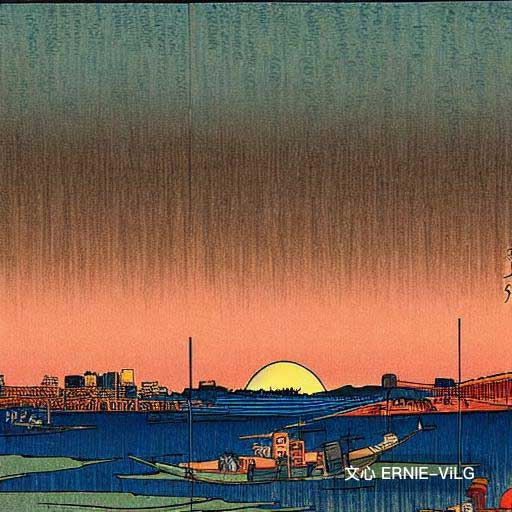 |
| ------------------------------------------------------------ | ------------------------------------------------------------ |
| 一只猫坐在椅子上，戴着一副墨镜,浮世绘风格                   | 日落时的城市天际线,浮世绘风格                               |

### 矢量心风格

| 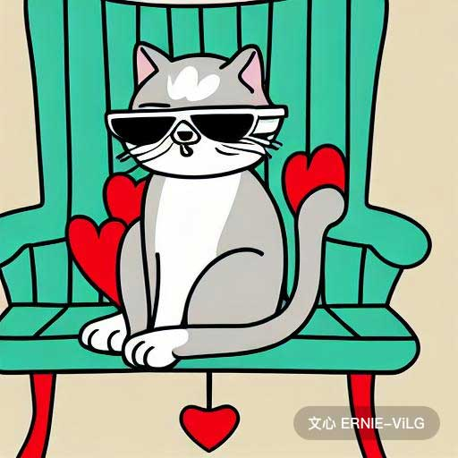 |  |
| ------------------------------------------------------------ | ------------------------------------------------------------ |
| 一只猫坐在椅子上，戴着一副墨镜,矢量心风格                   | 日落时的城市天际线,矢量心风格                               |

### 维京人风格

|  | 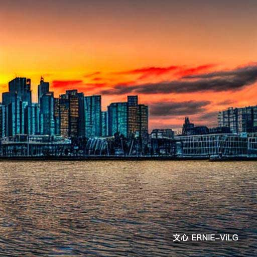 |
| ------------------------------------------------------------ | ------------------------------------------------------------ |
| 一只猫坐在椅子上，戴着一副墨镜,维京人风格                   | 日落时的城市天际线,维京人风格                               |

###  女巫店风格

|  |  |
| ------------------------------------------------------------ | ------------------------------------------------------------ |
| 一只猫坐在椅子上，戴着一副墨镜,女巫店风格                   | 日落时的城市天际线,女巫店风格                               |

### 后印象主义

|  |  |
| ------------------------------------------------------------ | ------------------------------------------------------------ |
| 一只猫坐在椅子上，戴着一副墨镜,风格：后印象主义              | 日落时的城市天际线, 风格：后印象主义-v2                      |

### 素人主义

|  |  |
| ------------------------------------------------------------ | ------------------------------------------------------------ |
| 一只猫坐在椅子上，戴着一副墨镜,风格：素人主义                | 日落时的城市天际线, 风格：素人艺术                           |

## ShowCase

#### 故障艺术

|  |  |  |  |
| ------------------------------------------------------------ | ------------------------------------------------------------ | ------------------------------------------------------------ | ------------------------------------------------------------ |

#### 蒸汽波艺术

|  |  |  |
| ------------------------------------------------------------ | ------------------------------------------------------------ | ------------------------------------------------------------ |

#### 包豪斯艺术

|  |  |
| ------------------------------------------------------------ | ------------------------------------------------------------ |

#### 概念艺术

|  |  |
| ------------------------------------------------------------ | ------------------------------------------------------------ |

#### 像素艺术

|  |  |  |  |
| ------------------------------------------------------------ | ------------------------------------------------------------ | ------------------------------------------------------------ | ------------------------------------------------------------ |

#### 艺术家

|  |  |
| ------------------------------------------------------------ | ------------------------------------------------------------ |
| 萨尔瓦多·达利描绘古代文明的超现实主义梦幻油画,写实风格       | 梵高猫头鹰,蒸汽波艺术                                        |

## Prompt 更多信息

#### 概念组合

## 附录

### 常见的艺术家和艺术风格整理

| 艺术类型   | 艺术家                 | 常用艺术风格           |
| ---------- | ---------------------- | ---------------------- |
| 肖像画     | 文森特·梵高            | 印象主义               |
| 风景画     | 尼古拉斯·罗伊里奇      | 现实主义               |
| 风俗画     | 皮埃尔-奥古斯特·雷诺阿 | 浪漫主义               |
| 宗教绘画   | 克劳德·莫内            | 表现主义               |
| 抽象画     | 彼得·孔查洛夫斯基      | 后印象主义             |
| 都市风景画 | 卡米尔·毕沙罗          | 象征主义               |
| 素描与草图 | 约翰·辛格·萨金特       | 新艺术主义             |
| 静物       | 伦勃朗                 | 巴洛克风格             |
| 裸体画     | 马克·夏加尔            | 抽象表现主义           |
| 插画       | 巴勃罗·毕加索          | 北欧文艺复兴           |
|            | 古斯塔夫·多雷          | 素人艺术，原始主义     |
|            | 阿尔布雷特·丢勒        | 立体主义               |
|            | 鲍里斯·库斯妥基耶夫    | 洛可可                 |
|            | 埃德加·德加            | 色域绘画               |
|            |                        | 波普艺术               |
|            |                        | 文艺复兴开端           |
|            |                        | 文艺复兴全盛期         |
|            |                        | 极简主义               |
|            |                        | 矫饰主义，文艺复兴晚期 |

### 常见的摄影风格词整理

| 可以加入到 Prompt 中的摄影词 |              |
| ---------------------------- | ------------ |
| 浅景深                       | 仰拍         |
| 负像                         | 动态模糊     |
| 微距                         | 高反差       |
| 双色版                       | 中心构图     |
| 角度                         | 逆光         |
| 三分法                       | 长曝光       |
| 抓拍                         | 禅宗摄影     |
| 软焦点                       | 抽象微距镜头 |
| 黑白                         | 暗色调       |
| 无镜反射                     | 长时间曝光   |
| 双色调                       | 框架，取景   |
| 颗粒图像                     |              |

## 关注我

